<p align="center">
  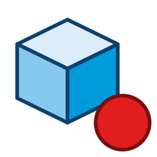
</p>

# Fair SketchUp Demo Recorder

Hammerspoon-based tool by [Fair Lab](http://befairlab.com/) for recording, editing, and replaying user click sequences inside SketchUp — with **pixel-exact viewport or whole-window capture**, auto-path replay, on-screen click + keystroke overlays, and automatic crop to YouTube + Reels mp4.

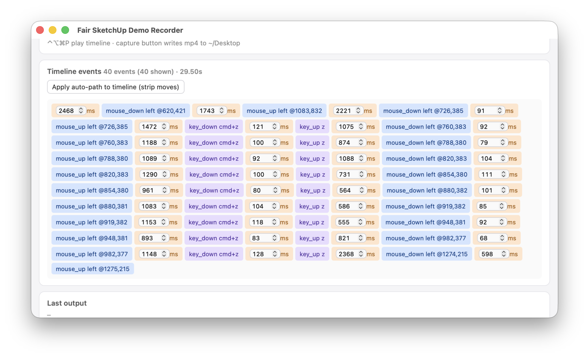

## Features

- 🎯 **Pixel-exact viewport OR whole-window capture** — pick one per preset. Viewport mode uses `Sketchup.resize_viewport(model, w, h)` to size the **3D model area** to your exact target (e.g. 1920×1080), no chrome in the mp4. Window mode resizes the **entire SU window** so toolbars and panels are captured for tutorials.
- **Record + replay** clicks, keystrokes, drags, scroll — and their precise timing
- **Auto-path mode** — drops recorded `mouse_move` events between clicks and substitutes smooth straight-line cursor motion at configurable speed + easing (drags are preserved)
- **Click circles** — animated rings rendered at every click, baked into the mp4
- **Keystroke overlay** — English-labelled pill in the corner shows pressed keys (incl. modifier-only clicks like `⌘ Click`); layout-independent
- **Capture area shift** — nudge the recording region without re-applying
- **Preset library** — viewport + playback + output stored as reusable `.json` files
- **Timeline ↔ preset linkage** — each timeline remembers its preset; mismatched applies show a warning
- **Universal presets** — record a square area once, auto-crop YouTube (16:9) + Reels (9:16) in one pass
- **Universal Custom** — set arbitrary source dims + crop targets
- **Output rescale** — ready-made presets (480p / 720p / 1080p / 1440p / 4K / Reels variants) or custom W×H
- **Continue recording** — append more events to an existing timeline
- **Dirty tracking** — explicit Save required; unsaved-changes badge per tab; discard confirms on tab switch
- **About / How-to / Requirements** docs

## Screens

### Viewport vs Window mode — the headline feature

|  Viewport mode (clean model area)  |  Window mode (full SU UI)  |
| --- | --- |
| 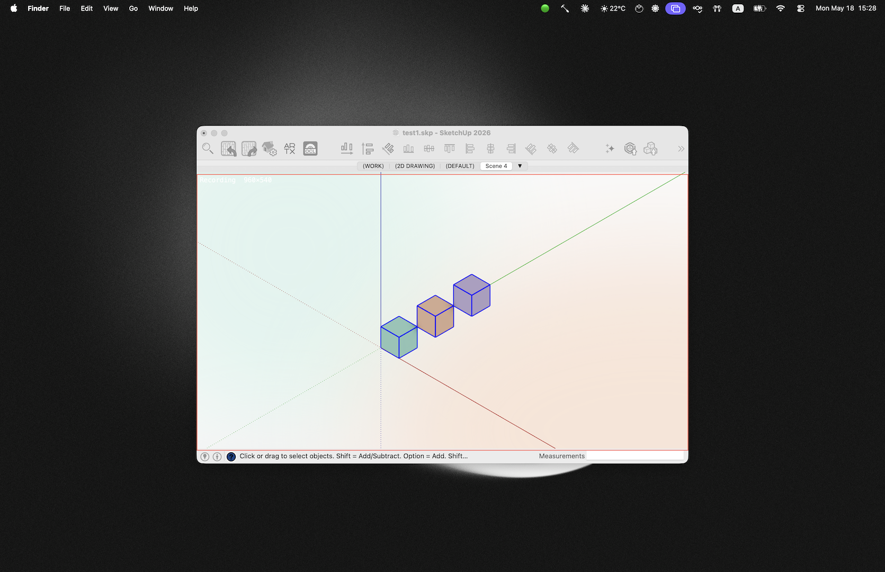 | 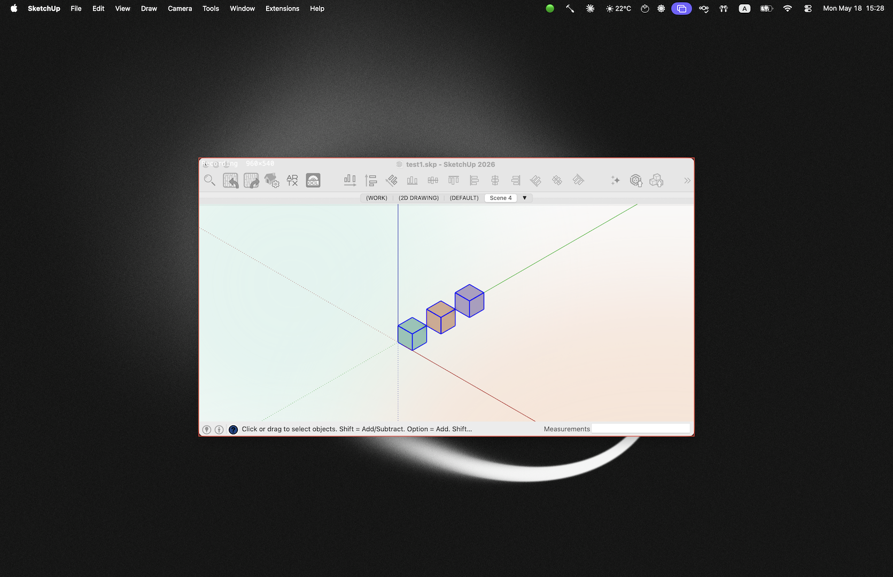 |

### Timeline editing in place

|  Recorded sequence  |  Skipped events + comments  |
| --- | --- |
|  | 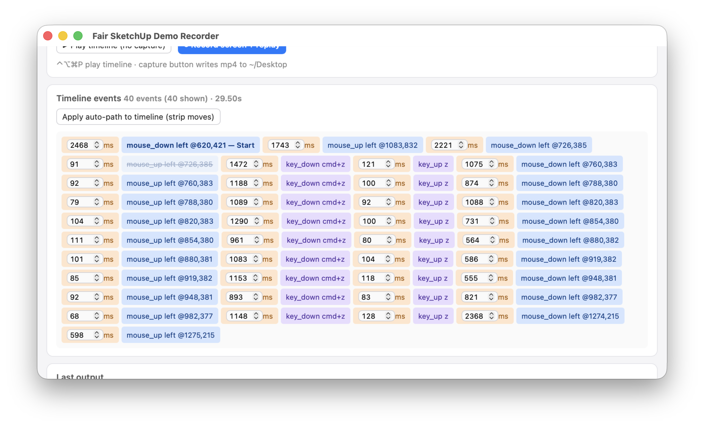 |

Click any event for a menu: **Delete · Skip during replay · Insert pause before / after · Comment**. Skipped events stay in the timeline (greyed + strikethrough) but are not replayed.

### Preset settings

|  Viewport  |  Playback  |  Output (non-universal)  |  Output (universal)  |
| --- | --- | --- | --- |
| 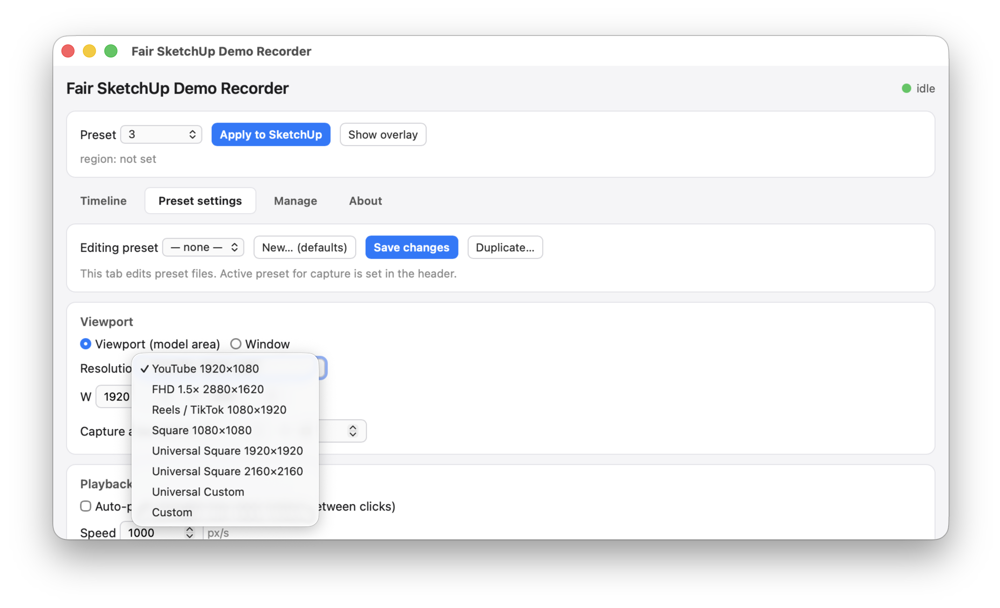 | 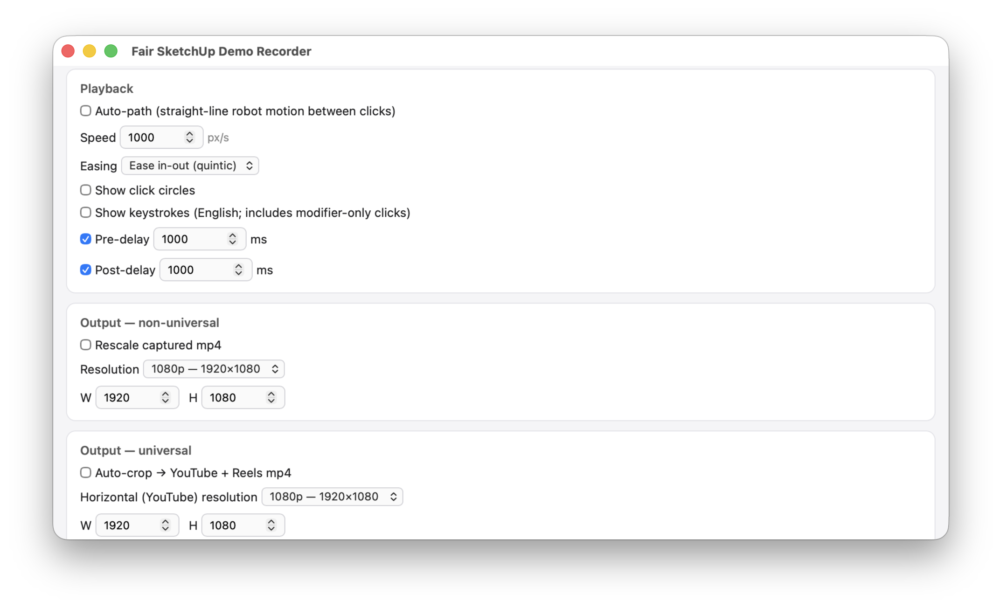 | 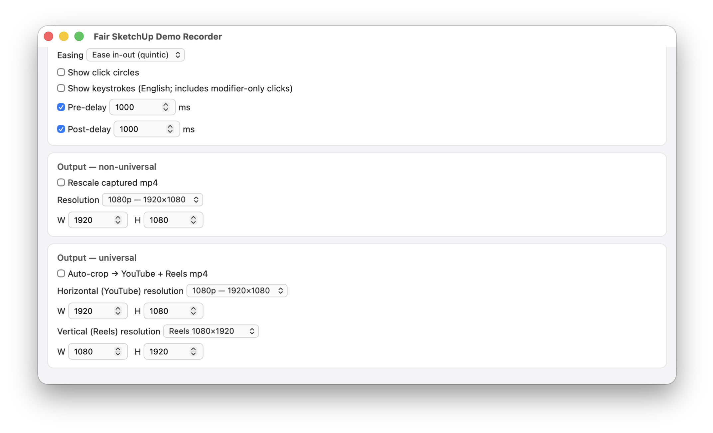 | 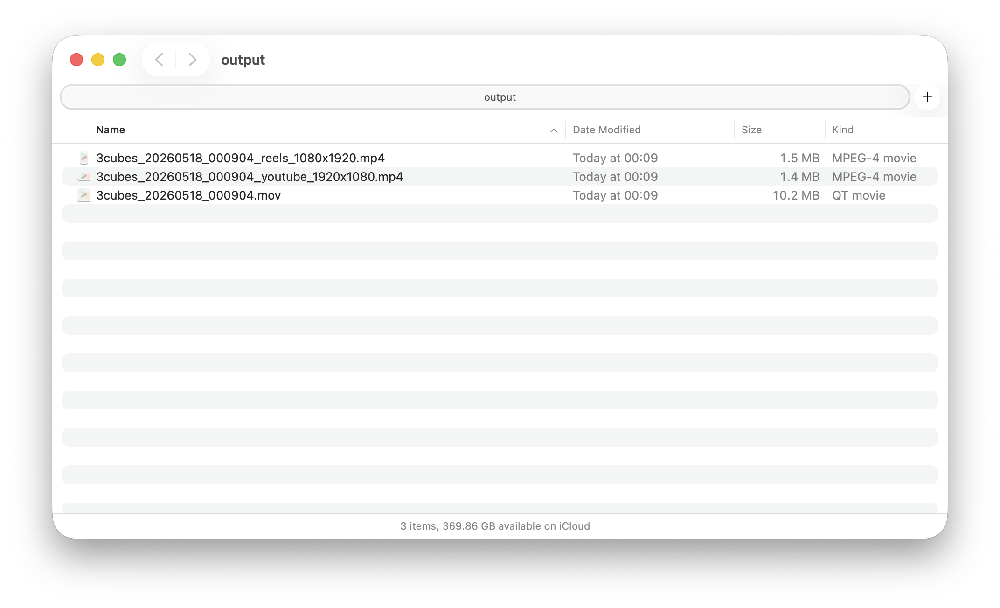 |

### Manage tab

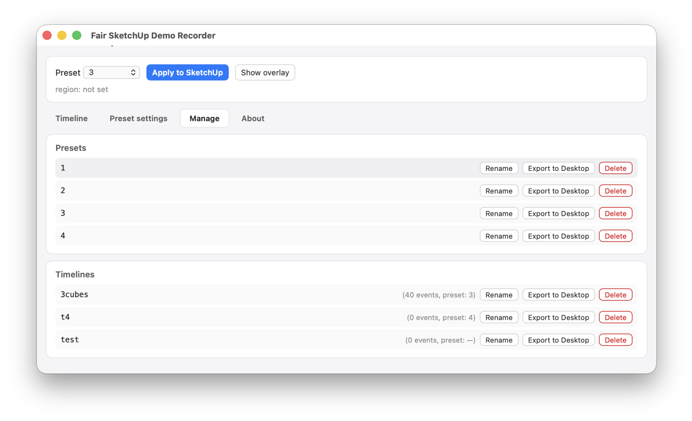

### Universal-preset overlay (YouTube + Reels safe zones)

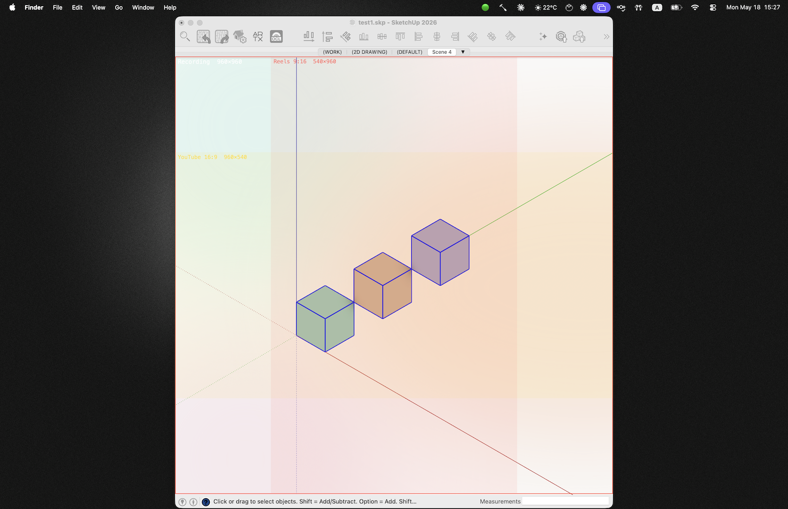

### Replay with click circles + keystroke pills (captured to mp4)

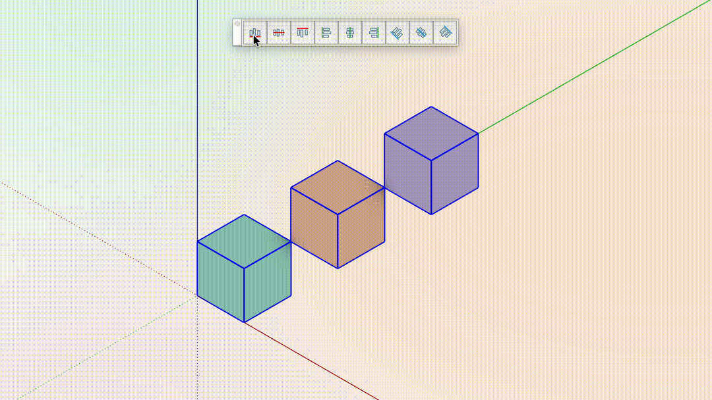

## Quick links

- [QUICKSTART.md](QUICKSTART.md) — install + first recording in 5 minutes
- [HOWTO.md](HOWTO.md) — end-to-end demo production
- [REQUIREMENTS.md](REQUIREMENTS.md) — macOS, SketchUp, Hammerspoon, ffmpeg
- [docs/specs/2026-05-16-design.md](docs/specs/2026-05-16-design.md) — original design doc

## Fair Lab

- Site: <http://befairlab.com/>
- Email: <hi@befairlab.com>
- GitHub: <https://github.com/BeFairLab>
- YouTube: <https://www.youtube.com/@BeFairLab>

## Stack

| Layer | Tech |
|---|---|
| Event capture / replay / window mgmt | Hammerspoon (Lua) |
| UI | HTML/JS in `hs.webview`, talking to Lua over a local `hs.httpserver` |
| Video capture | `screencapture -V` (region) with `ffmpeg` avfoundation fallback |
| Post-processing (crop / scale / encode) | `ffmpeg` |
| Storage | JSON sequences (`sequences/`) + presets (`presets/`) |
| SketchUp viewport resize | mini Ruby companion plugin (`SDR Companion`) reading `/tmp/sdr_cmd.json` |

## Layout

```
sketchup-demo-recorder/
├── README.md, QUICKSTART.md, HOWTO.md, REQUIREMENTS.md
├── hammerspoon/sdr/
│   ├── init.lua            # entry: wire modules, hotkeys, menubar
│   ├── recorder.lua        # global hs.eventtap → sequence events
│   ├── replayer.lua        # post mouse/keyboard events with auto-path + easing
│   ├── effects.lua         # click circles + keystrokes overlay (in mp4)
│   ├── store.lua           # sequences + presets JSON CRUD
│   ├── companion_bridge.lua # /tmp file IPC with SDR Companion
│   ├── window_sizer.lua    # apply preset, region calc, overlay canvas
│   ├── screen_capture.lua  # screencapture -V wrapper + ffmpeg fallback
│   ├── post_process.lua    # auto-crop + rescale ffmpeg pipelines
│   ├── ui.lua              # hs.webview + hs.httpserver bridge
│   └── us_keymap.lua       # ANSI keycode → English label (layout-independent)
├── companion/sdr_companion/
│   ├── sdr_companion.rb    # registrar (only registers extension)
│   └── sdr_companion/main.rb # logic: poll /tmp/sdr_cmd.json, resize viewport
├── ui/
│   ├── index.html, app.js, styles.css
├── scripts/install.sh
└── presets/, sequences/    # user data (.gitignored)
```

## License

[MIT License](LICENSE) — © 2026 Fair Lab (BeFairLab)
